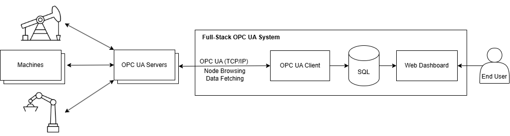
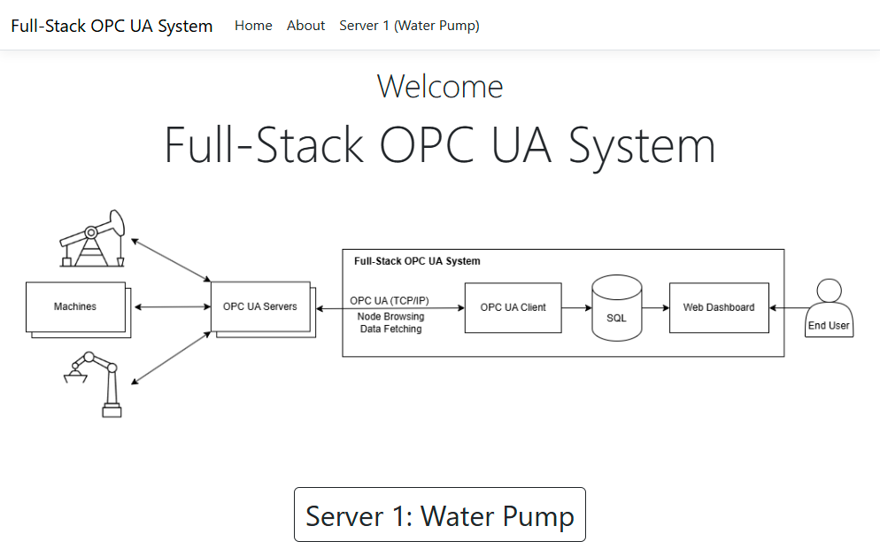

# Full-Stack OPC UA System

## Project Overview

The **Full-Stack OPC UA System** is a comprehensive solution for real-time monitoring and data analysis of industrial machines using the OPC UA protocol. This system connects to various machines, gathers data, processes it, and presents it on a web dashboard for users to monitor and analyze trends and raw data. The system is designed to facilitate seamless communication between OPC UA servers and clients, providing a reliable and scalable solution for industrial applications.

## Architecture



The system consists of several key components:

1. **Machines**: Industrial machines like water pumps, hydraulic fracturing machines, etc.
2. **OPC UA Server**: A server (simulated in Python in this project) that communicates with the machines, tracks their state, and provides data to the OPC UA Client.
3. **OPC UA Client**: A C# application using the OPC Foundation's .NET Stack to browse the server's node structure, read data, and store it in a Microsoft SQL Server database.
4. **SQL Database**: A Microsoft SQL Server database that stores machine data for further processing and analysis.
5. **Web Dashboard**: A web application built with ASP.NET and Bootstrap, which presents the machine data in graphical and tabular formats, and allows users to view trends and raw data.

## Features

- **Real-time Data Monitoring**: Continuously fetches and displays machine data like temperature, pressure, and pump settings.
- **Data Storage**: Stores historical data in a Microsoft SQL Server database for trend analysis.
- **Web Dashboard**: Provides interactive data visualizations, including graphs and trend charts.
- **API Access**: Exposes data via a REST API for further integration with other systems.
- **Demo**:



## Technologies Used

- **OPC UA**: Open Platform Communications Unified Architecture for secure, reliable communication between systems.
- **Python**: Used for simulating the OPC UA server.
- **C#**: Used for implementing the OPC UA client.
- **ASP.NET**: Used for building the web dashboard.
- **Bootstrap**: Frontend framework for responsive and stylish UI design.
- **Microsoft SQL Server**: Database used for storing machine data.
- **Visual Studio**: IDE used for development of the application.
- **Git**: Version control system for managing the project source code.

## Setup Instructions

### Prerequisites

To run this project locally, you will need the following:

- .NET SDK (version 6 or later)
- Python (version 3.x)
- Microsoft SQL Server (or any SQL database compatible with the project)
- Visual Studio (or any C# IDE)
- Node.js (for building frontend if needed)

### Installation

1. **Clone the Repository**

   ```bash
   git clone https://github.com/yourusername/full-stack-opc-ua.git
   cd full-stack-opc-ua
   ```
2. **Setting Up the Database**

-   Install Microsoft SQL Server and create a database (e.g., `OPCUA DB`).
-   Configure your connection string in `ConnectionString in Program.cs of Client.sln` and `appsettings.json in WebDashboard.sln`.
3.  Example configuration:

- in Program.cs of Client.sln,
    ```csharp
    private const string ConnectionString = "Server=(localdb)\\MSSQLLocalDB;Database=OPCUA DB;Trusted_Connection=True;";
    ```
- in appsettings.json in WebDashboard.sln,
    ```json
    "ConnectionStrings": { 
	    "OpcUaDbConnection": "Server=(localdb)\\MSSQLLocalDB;Database=OPCUA DB;Trusted_Connection=True;"
	}
    ```
4.  **Run the OPC UA Server**
    
	- Install required Python packages (Python 3 is required)
		`pip install -r requirements.txt`
	- Extract the  **sensor.csv**  file (120MB) located in the ZIP archive.
	- Run the script (Port  **4840**  needs to be open!):
	    `python opc-ua-server.py`  
	- The OPC UA server simulation code used in this project is based on [opc-ua-sensor-simulator](https://github.com/flopach/opc-ua-sensor-simulator). Please refer to that repository for additional details on how to set up and run the server.
5. **Run the Client**

	- Open the solution, `client/Client.sln`.
    - Build and run the project.
7.  **Run the Web Application**
    
    -   Open the solution, `web-dashboard/WebDashboard.sln`.
    -   Build and run the project.
    -   Navigate to `https://localhost:7234/` to view the dashboard.
8.  **Test the System**
    
    -   Open the web dashboard and verify that machine data is being displayed correctly.

## Usage

-   **Dashboard**: View real-time data and trends of the machines.
-   **API**: Access the latest machine data by visiting `https://localhost:7234/api/opcua/water-pump/latest`.
	- Resources are in JSON format
	```json
	{
		"temperatureData": [
		    {
		      "id": 183897,
		      "timestamp": "12/28/2024 05:40:20 PM",
		      "value": 45.226
		    },
		    ...
		],
		"pressureData": [
		    {
		      "id": 183898,
		      "timestamp": "12/28/2024 05:40:20 PM",
		      "value": 48.134
		    },
		    ...
		],
		"pumpSettingData": [
		    {
		      "id": 183899,
		      "timestamp": "12/28/2024 05:40:20 PM",
		      "value": "speed"
		    },
		    ...
		]
	}
	```

## Contributing

We welcome contributions to this project! If you'd like to contribute, please fork the repository and submit a pull request with your changes.

### Steps to Contribute:

1.  Fork the repository
2.  Create a new branch (`git checkout -b feature-branch`)
3.  Make your changes
4.  Commit your changes (`git commit -am 'Add new feature'`)
5.  Push to the branch (`git push origin feature-branch`)
6.  Create a pull request

## License

This project is licensed under the MIT License - see the LICENSE file for details.


## Acknowledgments

I would like to express our sincere gratitude to the following:

- **OPC Foundation** for providing the OPC UA standard, which serves as the backbone of this project.
- **Microsoft** for their exceptional tools and resources, particularly .NET, which has made the development of this application possible.
- **Bootstrap** for offering a responsive and easy-to-use front-end framework, which greatly enhanced the user interface design.
- **Florian Pachmair** for the development of the [opc-ua-sensor-simulator](https://github.com/flopach/opc-ua-sensor-simulator), whose simulation code provided a solid foundation for the OPC UA server in this project. We appreciate their contributions to the community and the open-source ecosystem.